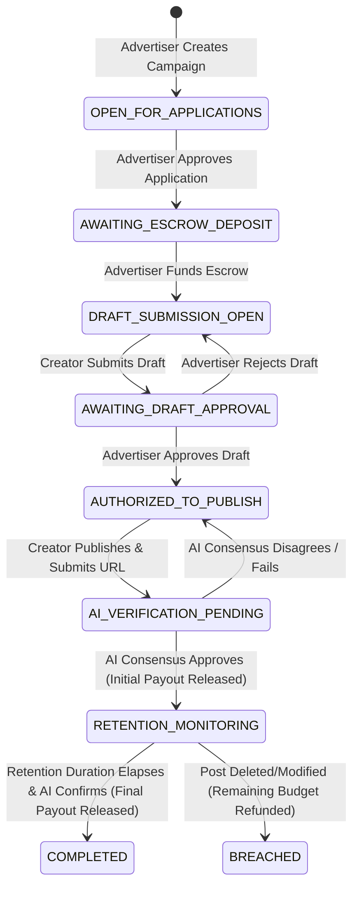

# AdPact — Decentralized, AI-Powered Creator Escrow & Sponsorship Marketplace

AdPact is a decentralized marketplace that secures creator sponsorships through trustless smart contracts and on-chain AI consensus. Built on the **GenLayer** network, AdPact completely replaces manual human intermediaries, escrow fees, and payment delays (such as traditional Net-30 or Net-60 terms) with an automated, cryptographically secure state machine.

---

## 👁️ Overview

Advertisers and creators often suffer from mutual distrust. Advertisers fear paying for posts that are deleted, edited, or never published, while creators fear unpaid work and delayed compensation.

**AdPact solves this through on-chain AI and multi-stage escrows:**
1. **Secure Funding**: Advertisers commit the campaign budget into the intelligent contract escrow upfront.
2. **On-Chain Scrapers**: Validator nodes query live tweet status URLs using non-deterministic web scrapers.
3. **AI Consensus Verification**: GenLayer's decentralized LLM consensus checks that posts are public, match the required keywords/hashtags, and correspond to the pre-approved draft.
4. **Automated Payouts**: Completed phases automatically credit the creator's secure, re-entrancy safe virtual ledger for instant withdrawal.

---

## 🛠️ Architecture & Tech Stack

AdPact is split into a hybrid Python/Javascript architecture:
- **Intelligent Escrow Contract** (`/contracts/influencer_escrow.py`): Built in Python for GenVM, managing campaigns, creator applications, state transitions, virtual balances, and non-deterministic consensus loops.
- **DApp Frontend** (`/app/`): A state-of-the-art Vue 3 SPA powered by **Vite** and **Tailwind CSS**. Styled with dynamic dark/light aesthetics, a curated Outfit/Inter font system, HSL color tokens, and custom micro-animations.
- **GenLayer SDK Integration** (`/app/src/services/`): Powered by `genlayer-js` to connect to wallets, perform network switches, query contract mappings, and sign transactions.
- **In-Memory Testing Framework** (`/tests/direct/`): Python unit tests running in GenLayer's "direct" in-memory runner for instant contract state verification.

---

## 🔄 The Escrow State Machine

Every sponsorship moves through a rigid, secure lifecycle enforced by the intelligent contract:



---

## 📦 Project Structure

```bash
├── app/                      # Vite + Vue 3 DApp Frontend
│   ├── public/               # Static assets (favicons, modern logo.svg)
│   ├── src/                  # Component logic, views, styling, and services
│   ├── vercel.json           # Vercel SPA routing and redirect configuration
│   └── package.json          # Frontend packages & compile scripts
├── contracts/                # Python Intelligent Contracts
│   ├── influencer_escrow.py  # Main production AdPact contract
│   └── football_bets.py      # Legacy boilerplate contract
├── tests/                    # Contract Testing Suite
│   └── direct/               # Fast in-memory unit tests
├── .gitignore                # Production-grade git excludes (stops PK leaks)
├── vercel.json               # Root Vercel redirect rules
├── requirements.txt          # Python SDK requirements
└── package.json              # Main project structure
```

---

## 🚀 Getting Started

### 1. Requirements
Ensure you have the following installed:
*   [Node.js (v18+)](https://nodejs.org/) & `npm` / `pnpm`
*   [Python 3.10+](https://www.python.org/)
*   A running [GenLayer Studio](https://studio.genlayer.com/) (local or cloud)

### 2. Secure Local Configurations
Rename the `.env.example` template files to configure your network RPC endpoints:
```bash
# In the project root
cp .env.example .env

# In the app/ directory
cp app/.env.example app/.env
```
*Note: The `.gitignore` is pre-configured to strictly exclude all `*.env` files and `app/scratch/` directories so you never accidentally expose private keys or RPC credentials to GitHub.*

### 3. Deploying the Intelligent Contract
1. Copy the code from `contracts/influencer_escrow.py`.
2. Open the **GenLayer Studio** (usually at `http://localhost:8080` or `https://studio.genlayer.com/`).
3. Paste the code into a new contract file.
4. Deploy the contract using the Studio "Run and Debug" panel.
5. Copy the deployed contract address.
6. Open your `app/.env` file and set the address:
   ```env
   VITE_CONTRACT_ADDRESS="0x..."
   ```

### 4. Running the Frontend DApp
Navigate to the `app/` folder, install dependencies, and start the Vite server:
```bash
cd app
npm install
npm run dev
```
Open the provided local server link (usually `http://localhost:5173`) in your browser.

### 5. Reviewer & Judge Sandbox Testing Guide (Safe & Local)

Reviewers and judges can test the **complete, end-to-end intelligent contract lifecycle**—including AI-consensus oracle checks, web scraping, and deadline enforcement—without needing MetaMask, setting up private wallets, or deploying to a public network. 

We utilize GenLayer's **direct test runner**, which simulates the GenVM execution environment in-memory.

#### Run all tests:
1. Install Python dependencies:
   ```bash
   pip install -r requirements.txt
   ```
2. Execute the test suite:
   ```bash
   pytest -v tests/direct/
   ```

#### What these tests validate:
*   `test_influencer_escrow_lifecycle`: Simulates the complete creator-sponsor flow:
    1. **Campaign Creation:** Advertiser creates a campaign with specific hashtags and keywords.
    2. **Application:** Creator applies with their Twitter handle.
    3. **Approval & Escrow Funding:** Advertiser approves the application and deposits the campaign budget.
    4. **Milestone 1 (Draft Approval):** Creator submits a draft, and the advertiser approves it.
    5. **Milestone 2 (AI Web Consensus):** Creator submits a live post URL. The test mocks a live tweet scraper response and the LLM consensus oracle to verify the content against the pre-approved draft, releasing the initial payout.
    6. **Milestone 3 (Retention Check):** Travels forward in time and runs the retention monitoring check via mocked LLM oracle, completing the campaign and releasing the final payout to the creator's virtual ledger.
    7. **Withdrawal:** Creator withdraws their earnings from the escrow.
*   `test_influencer_escrow_deadline_check`: Verifies that the contract correctly enforces UTC-based posting deadlines and rejects applications if the campaign has expired.
*   `test_user_balance` & `test_user_balance_no_withdraw`: Verifies the safety of the virtual ledger, ensuring funds can only be withdrawn by the intended creator.

All tests run locally in under **1 second** and require absolutely no private credentials or setup.

---

## 🛡️ Secure Development & Publishing Checklist
Before pushing this repository to GitHub or public hosts:
1. **Never Commit Private Keys**: Do not write keys to contract code, Vue components, or frontend services.
2. **Environment Variables**: Always store keys and private network URLs in `.env` files (already gitignored).
3. **Clean Cache**: Ensure Python `__pycache__` and node dependencies are ignored (automatically covered by our `.gitignore`).
4. **Vercel Deployments**: The included `vercel.json` provides rewrite safety so that deep-linking directly to `/about` or `/analytics` does not trigger Vercel's `404 Not Found` page on production builds.

---

## 📜 License
This project is licensed under the MIT License - see the [LICENSE](LICENSE) file for details.
